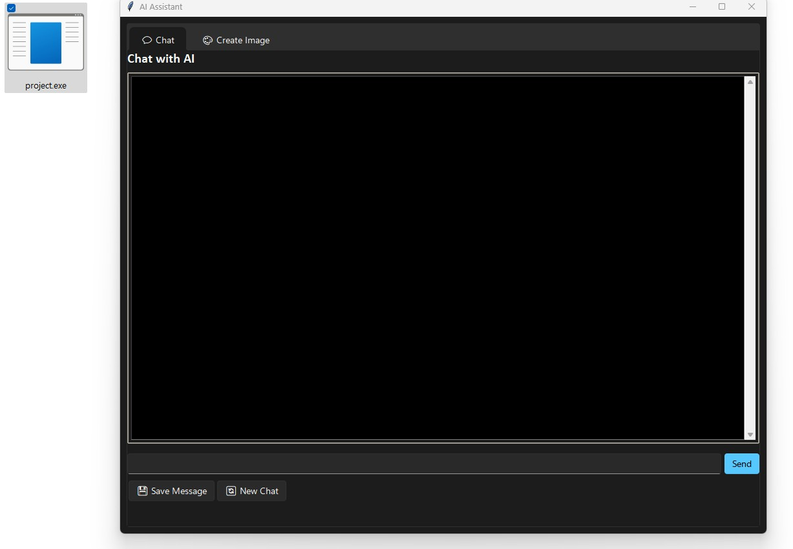

# AI Assistant - Standalone Executable

This project is an **AI Assistant** application built using **Python**, **Tkinter**, and **OpenAI's GPT**. The application is designed to allow users to interact with an AI assistant through a chat interface and create images using AI. 

This README provides instructions on how to build the application into a **standalone executable** using **PyInstaller**.

## Features

- **Chat with AI**: Interact with a powerful AI assistant based on OpenAI's GPT-4o-mini.
- **Create Images**: Generate AI images using text descriptions.
- **Save Chat History**: Option to save the conversation as a `.docx` file.
- **GUI**: Simple user interface built with Tkinter.

## Installation

### 1. Prerequisites

Before building the executable, make sure you have Python and the necessary packages installed:

- **Python**: Version 3.7 or above.
- **Libraries**:
    - Tkinter (usually bundled with Python)
    - OpenAI
    - Pillow (for image handling)
    - PyInstaller (for building the executable)


# Using Your Own OpenAI API Key

To interact with OpenAI's GPT and image generation models, you need to set up your own OpenAI API key. Below are the steps to configure the API key in the application:

## 1. Obtain Your OpenAI API Key

Follow these steps to get your API key from OpenAI:

1. Visit [OpenAI's website](https://beta.openai.com/signup/) and sign up for an account (or log in if you already have one).
2. After logging in, go to the [API section](https://beta.openai.com/account/api-keys).
3. Copy your **API key**.

## 2. Configure Your API Key in the Code

Once you have your API key, you need to set it in the Python code for the application. Follow these steps:

1. Open the Python file where the OpenAI client is initialized (e.g., `main.py`).
2. Locate the following line in the `MultiAIApp` class:

3. replace the api_key with your api key.
   ```python
   api_key = 'your-openai-api-key'


 ## 3. How to Create an Executable with PyInstaller

This guide explains how to use **PyInstaller** to convert a Python script (`main.py`) into a standalone executable file.

## Prerequisites

Before using **PyInstaller**, make sure you have the following:

- **Python**: Ensure you have Python installed on your system.
- **PyInstaller**: PyInstaller is a Python package that bundles your Python script and its dependencies into an executable.

### Install PyInstaller

To get started, you first need to install PyInstaller using pip. Open your terminal and run the following command:

```bash
pip install pyinstaller

then run the  'python build_exe.py'


